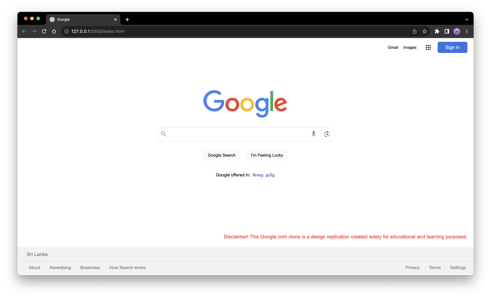
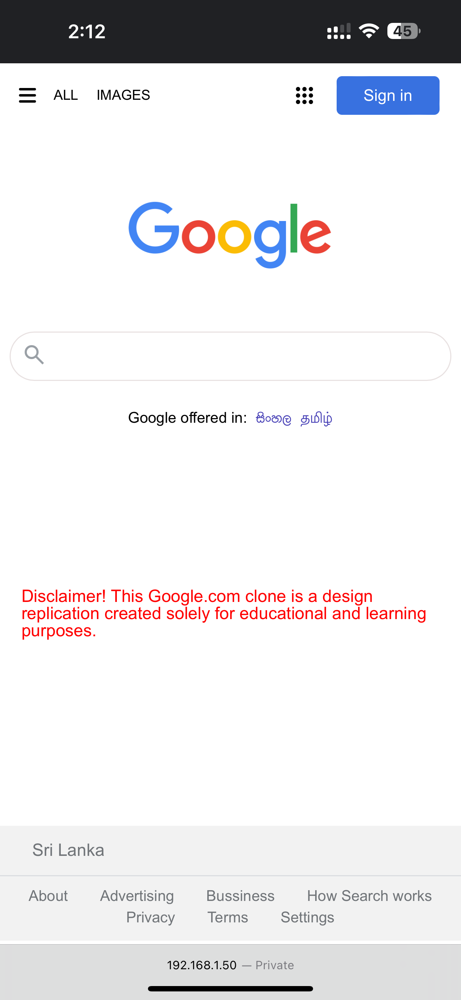
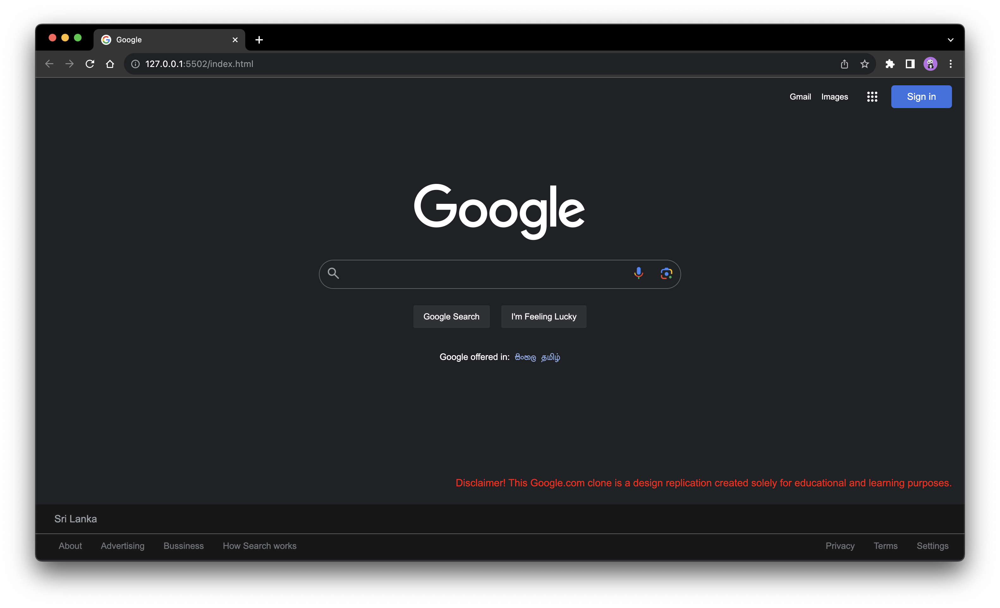
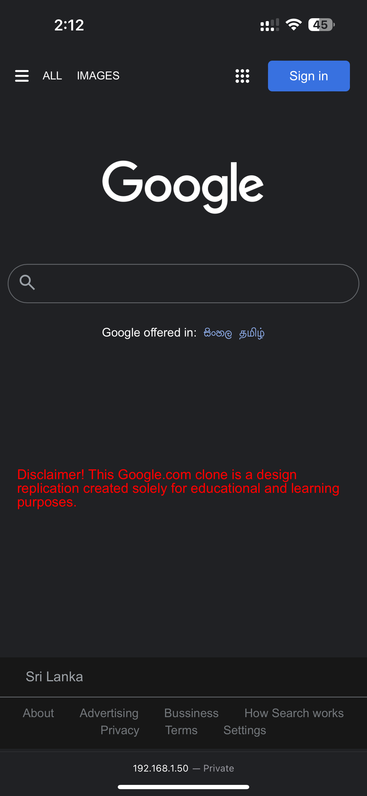
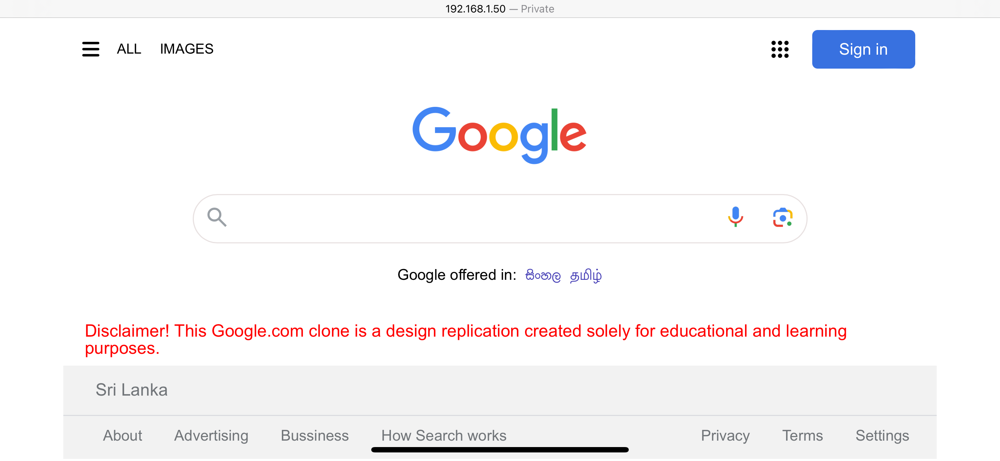
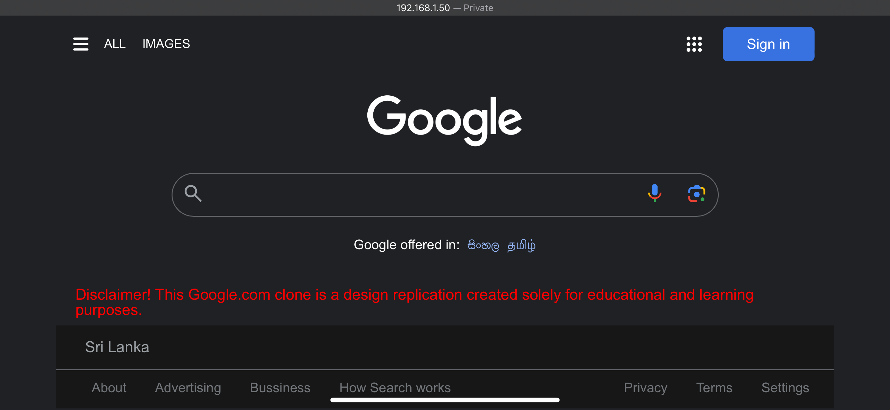

# Google.com Design Clone

[View the project live on GitHub Pages](https://lakith-rathnayake.github.io/google-design-clone)

## Table of Contents

- [Description](#description)
- [Features](#features)
- [Usage](#usage)
- [Technologies Used](#technologies-used)
- [Screenshots](#screenshots)
- [Contributing](#contributing)
- [License](#license)

## Description

This project is a clone of the Google.com search engine, designed to provide a seamless user experience across various devices. The web page is **fully responsive**, ensuring optimal viewing and interaction on both desktop and mobile platforms.

Additionally, I have implemented a **dark mode** feature, allowing users to switch to a visually-friendly dark theme, which not only reduces eye strain but also enhances the overall browsing experience.

Moreover, this Google.com clone supports **landscape mode** on mobile devices, optimizing the layout for wider screens. This ensures that users get a consistent and user-friendly experience regardless of their device's orientation.

The project's responsive design, dark mode, and landscape mode capabilities make it a versatile and user-centric alternative to the original Google search page.

## Features

- Basic search functionality
- Display of search results
- Light and Dark themes

## Usage

You can access and interact with the Google.com clone directly from your web browser without the need to clone or download the repository. Simply follow these steps:

1. Go to the [Google.com Clone GitHub Pages](https://lakith-rathnayake.github.io/google-design-clone) link.

2. The page will load in your browser.

3. Perform a Search:

   - In the search bar, enter the query you'd like to search for.
   - Press the "Enter" key or click on the search button.

4. Explore the Search Results:

   - View the search results displayed on the page.

5. Toggle Dark Mode (If applicable):

   - Toggle the dark mode in your device and switch between light and dark themes.

6. Test Landscape Mode (If applicable):

   - On a mobile device, rotate your screen to landscape orientation to see how the layout adjusts.

7. Optional: Contribute or Customize:
   - If you'd like to contribute to or customize the project, refer to the [Contributing](#contributing) section in this README.

## Technologies Used

- HTML
- CSS

## Screenshots

### Desktop View

### Mobile View

### Dark Mode

### Landscape Mode

## Contributing

If you'd like to contribute to this project, please follow these steps:

1. Fork the repository
2. Create a new branch (`git checkout -b feature/your-feature`)
3. Make your changes
4. Commit your changes (`git commit -m 'Add some feature'`)
5. Push to the branch (`git push origin feature/your-feature`)
6. Create a new pull request

## License

Copyright &copy; 2023 Lakith Rathnayake. All Rights Reserved.  
This project is licensed under the [MIT License](LICENSE.txt).

## Disclaimer

This Google.com clone is a design replication created solely for educational and learning purposes. All product logos, designs, and trademarks, with the exception of the code, are copyrighted and belong to their respective owners. This project is not affiliated with or endorsed by Google.
